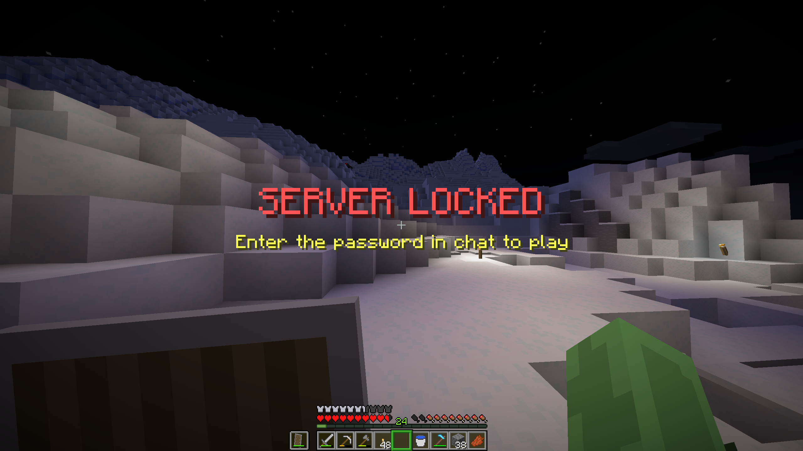
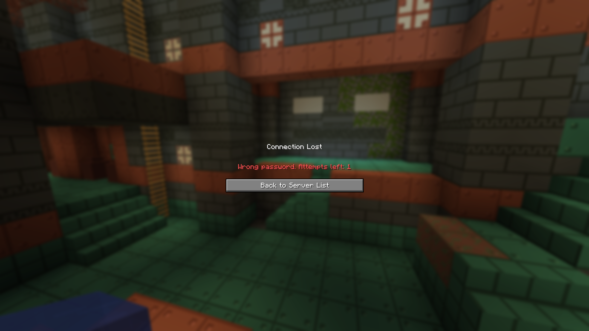
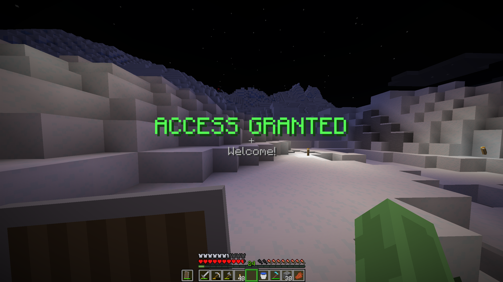

# Server Password Plugin for Minecraft Spigot Servers
This is a Java plugin built for Spigot Minecraft Servers. This plugin requires players to enter a password before they are allowed to play. The password is a string controlled by the server host and admins. When a player joins the server for the first time, a prompt will appear on their screen that the server is locked and they must enter the password in chat to play. In this state the player cannot move, place or destroy blocks, interact with blocks, give or take damage, and type in public chat. If they get the password correct, they get an acceptance message and are free to play. They do not have to re-enter the correct password upon joining again unless their status is changed to "unverified". If the player gives the incorrect password, they are kicked from the server. By default, the plugin tracks the amount of times a player has entered the incorrect password and that player is banned if they enter too many incorrect attempts (default is 3).

This plugin was created to combat server pingers / griefers, and as an alternative to setting a whitelist. Recently there have been several groups running bots that join Minecraft servers to test and track servers that are online / open. In many cases, this leads to people's private servers getting griefed. There are a couple ways around this, including setting the server port to an uncommon number to avoid getting pinged by a group, or setting up a whitelist. I didn't like the idea of either of these as changing the port can lead to complications and setting a whitelist means having a pre-determined list of all your potential players. So, I created this plugin as a way to stop griefing from these groups while keeping the server open. Unlike a whitelist, when this plugin is used, the server owner can send out the password alongside the IP instead of trying to whitelist everyone's usernames.

## Minecraft and Spigot Version
Native version: 1.21\
Tested versions: 1.21

## How to Install
Installation is very easy for this plugin. Simply download the JAR from the releases (ex: ServerPassword.jar from v1.0) and place it in your **plugins** folder for your Spigot server.

The next time you start your server, the plugin should be active and have automatically created its required config and data storage file.

## Default Config Info
This plugin's default configurations include a **password** setting and a **allowed-attempts** setting.

**Password**: This is one method of how you set the required password to play on the server. By default this is set to "password", so it is recommended that you change this value.

**Allowed-attempts**: This is the amount of incorrect attempts a player is allowed before they are banned. By default this value is 3. This can be set to a value of -1 for unlimited attempts.

## Plugin Commands
     /setPlayerAttempts
#### Args: /setPlayerAttempts &lt;player&gt; &lt;amount&gt;
#### Required permission: admin
This command changes the amount of attempts registered and stored for a specific player. The player must have joined the server previously to work.

---

     /verify
#### Args: /verify &lt;player&gt;
#### Required permission: admin
This command sets the verification status of the specified player to true. The player must have joined the server previously to work.

---

     /unverify
#### Args: /unverify &lt;player&gt;
#### Required permission: admin
This command sets the verification status of the specified player to false. The player must have joined the server previously to work.

---

     /setServerPassword
#### Args: /setServerPassword &lt;password&gt;
#### Required permission: admin
This command changes the required password for the server. It updates both the real-time server and the config.yml.

---

     /audit
#### Args: /audit &lt;player&gt;
#### Required permission: admin
This command gives you the specified player's verification status and their attempt count. The player must have joined the server previously to work.

## Images

